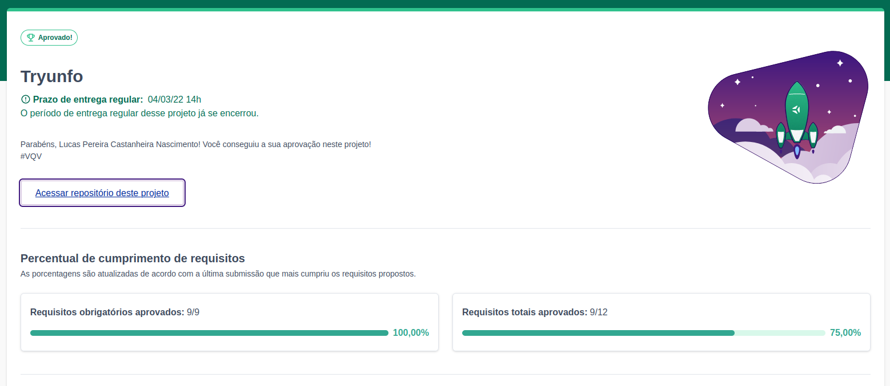

# Tryunfo
<h2>:brazil: Português :brazil:</h2>

Projeto entregue durante o curso de desenvolvimento Web ministrado pela <a href="https://www.betrybe.com" targe="_blank" rel="nofollow">Trybe</a>.

Obtive a aprovação no projeto completando 100% dos requisitos obrigatórios. Efetivando, assim, a conclusão do Bloco 11 (Componentes com Estado, Eventos e Formulários com React) referente ao Módulo 2 (Desenvolvimento Front-end).

Descrição:
 

O projeto tinha como objetivo desenvolver um jogo no estilo Super Trunfo! Ao utilizar essa aplicação uma pessoa usuária deverá ser capaz de:

<ol>
<li>Criar um baralho, com o tema livre;</li>
<li>Adicionar e remover uma carta do baralho;</li>
<li>Visualizar todas as cartas que foram adicionadas ao baralho;</li>
</ol>

Habilidades desenvolvidas

<ol>
<li>Ler o estado de um componente e usá-lo para alterar o que exibimos no browser;</li>
<li>Inicializar um componente, dando a ele um estado pré-definido;</li>
<li>Atualizar o estado de um componente;</li>
<li>Capturar eventos utilizando a sintaxe do React;</li>
<li>Criar formulários utilizando sintaxe JSX com as tags: input, textarea, select, form, checkbox;</li>
<li>Transmitir informações de componentes filhos para componentes pais via callbacks;</li>
</ol>

Link para conferência: https://lucas-pcn.github.io/tryunfo/

<a href="https://www.linkedin.com/in/lucas-pereira-castanheira-nascimento-238355190/" targe="_blank" rel="nofollow">Meu Linkedin</a>.

 

<h2>:us: English :us:</h2>

Project delivered during the Web development course taught by <a href="https://www.betrybe.com" targe="_blank" rel="nofollow">Trybe</a>.

I passed the project by completing 100% of mandatory and optional requirements. Thus, completing Block 11 (Stateful Components, Events and React Forms) referring to Module 2 (Front-end Development).

Description:

The project aimed to develop a game in the style of Super Trunfo! When using this application a user should be able to:

<ol>
<li>Create a deck, with the free theme;</li>
<li>Adding and Removing a Card from the Deck;</li>
<li>View all cards that have been added to the deck;</li>
</ol>

Developed skills

<ol>
<li>Read the state of a component and use it to change what we display in the browser;</li>
<li>Initialize a component, giving it a predefined state;</li>
<li>Update the state of a component;</li>
<li>Capture events using React syntax;</li>
<li>Create forms using JSX syntax with tags: input, textarea, select, form, checkbox;</li>
<li>Pass information from child components to parent components via callbacks;</li>
</ol>

Conference link: https://lucas-pcn.github.io/tryunfo/

<a href="https://www.linkedin.com/in/lucas-pereira-castanheira-nascimento-238355190/" targe="_blank" rel="nofollow">My Linkedin</a>.

